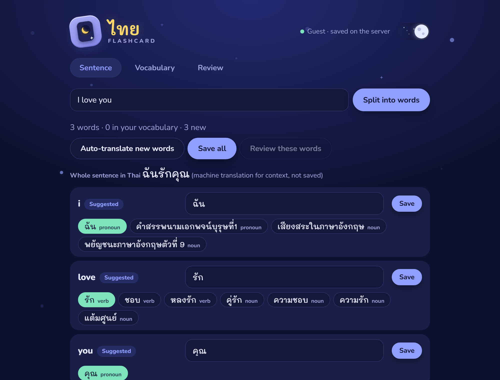
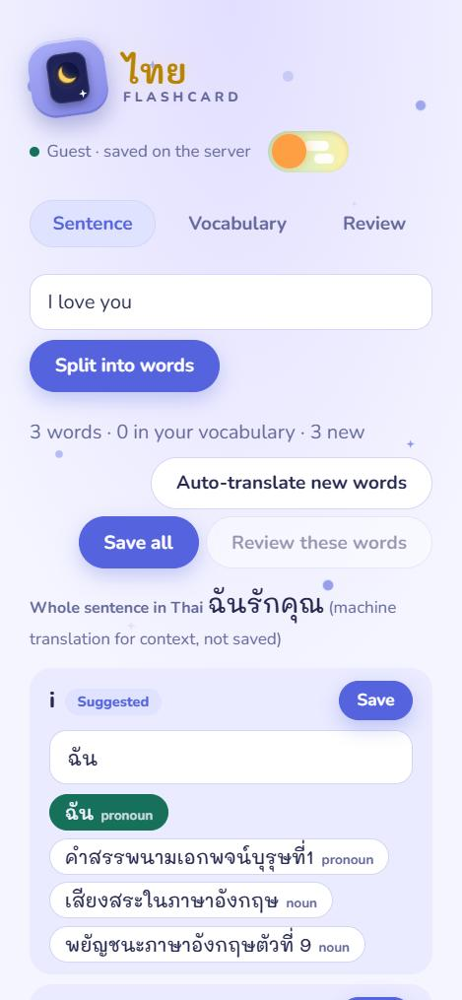
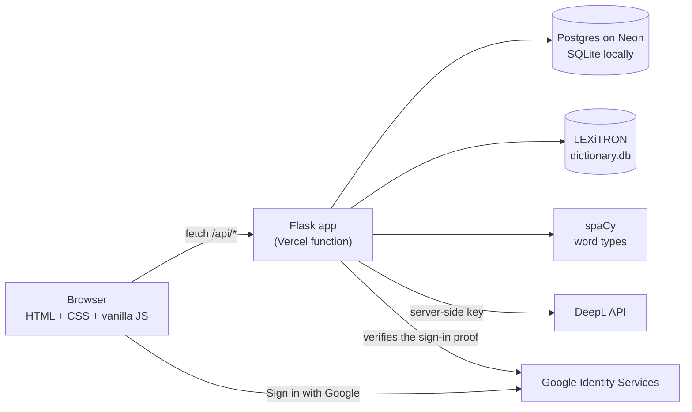

# Thai Flashcards

Type an English sentence, split it into words, and turn each word into a Thai flashcard. Words are saved to your own account, so they follow you from your laptop to your phone.

**Live demo: https://thai-flashcards-three.vercel.app** (no sign-up: you start as a guest, and Google sign-in is optional)

<p align="center">
  
</p>

<p align="center">
  
</p>

## What it does

1. **Split a sentence.** "I love you" becomes three words.
2. **Get Thai suggestions.** For each new word the app proposes a Thai meaning and shows the alternatives as buttons you can tap, each labeled with its word type (noun, verb, ...).
3. **Save the words** and **review them** as flip cards, English first or Thai first.
4. **Keep them anywhere.** Visitors get a private guest account automatically. Signing in with Google keeps the words across devices and merges any guest words into the account.

## How a suggestion is made

Three sources work together, each doing what it is best at:

| Source | Used for | Notes |
|---|---|---|
| [DeepL](https://www.deepl.com/) | The whole sentence, and each word *in the context of that sentence* | Context is why "love" in "I love you" becomes the verb รัก instead of "to like". |
| [LEXiTRON](https://github.com/brianbv/lexitron-data) dictionary (NECTEC) | The other meanings of each word, shown as alternatives | About 83,000 entries in a local SQLite file. No network, no quota. |
| [spaCy](https://spacy.io/) | The word type, from the English sentence | Runs inside the server, no key needed. |

If DeepL is unavailable or the daily limit is used, the dictionary and the word types still work.

## Architecture



There is no front-end framework and no build step: `public/` holds one HTML file, one stylesheet and one script.

## Design decisions worth a look

- **Every query is scoped to the user.** Each word has a `user_id`, and every read, edit and delete filters on it, so one person can never reach another's words even by guessing ids. Tested with two simulated visitors.
- **Guest accounts, then Google.** A visitor can use the app at once. The server creates the guest account on the first save and remembers it in a signed `HttpOnly`, `SameSite=Lax` cookie (`Secure` too when `COOKIE_SECURE=1`).
- **The server verifies Google sign-in, never the page.** The browser sends Google's signed proof; the server checks the signature, the expiry and that it was issued for this app's client id before trusting the email.
- **One database layer, two databases.** `database.py` runs the same SQL on SQLite (local) and Postgres (online). Differences are hidden in one small wrapper (`?` vs `%s` placeholders, `RETURNING id`).
- **Limits live in the database, not in memory.** On Vercel each request can run on a fresh copy of the app, so an in-memory counter would reset every time. Counters are updated with one atomic upsert and are rolled back together with a refused request. Network addresses are stored only as a salted hash.
- **Secrets stay on the server.** The DeepL key, database address and signing key are environment variables. The app refuses to start online without `SECRET_KEY`.
- **Only three files are public.** An allowlist serves `index.html`, `style.css` and `script.js`; everything else (source, database files, `.env`) returns 404. API replies are `Cache-Control: no-store`.

### Usage limits

| | Guest | Signed in with Google |
|---|---|---|
| DeepL translations per day | 15 | 60 |
| Characters sent to DeepL per day | 1,500 | 6,000 |
| Saved words | 200 | 2,000 |

Site-wide: 15,000 DeepL characters per day (set with `DEEPL_GLOBAL_DAILY_CHARS`), 500 new guest accounts per day, and 10 new guests per network per hour. The numbers are in [`limits.py`](limits.py).

## Run it locally

You need Python 3.12 or newer (developed and tested on 3.14).

```bash
git clone https://github.com/Natthawat-17/thai-flashcards.git
cd thai-flashcards
python -m venv .venv
.venv/Scripts/activate        # on macOS/Linux: source .venv/bin/activate
pip install -r requirements.txt
python app.py
```

Open http://127.0.0.1:5000. With no settings at all, the app uses a local SQLite file, the bundled dictionary and spaCy. DeepL and Google sign-in switch on when you add their settings.

To configure it, copy `.env.example` to `.env` and fill in what you need:

| Setting | Purpose |
|---|---|
| `DATABASE_URL` | A `postgresql://` address (for example from Neon). Leave it empty to use SQLite. |
| `DEEPL_API_KEY` | Turns on sentence and in-context word translation. |
| `GOOGLE_CLIENT_ID` | Turns on Sign in with Google. Add your site's address to the client's *Authorized JavaScript origins*. |
| `LEGACY_OWNER_EMAIL` | Optional: the Google account that receives words saved before accounts existed. |
| `DEEPL_GLOBAL_DAILY_CHARS` | Optional: the site-wide daily DeepL limit (default 15000). |
| `SECRET_KEY` | Signs the cookie. Created automatically on your computer; **required online**. |
| `COOKIE_SECURE`, `TRUST_PROXY` | Set both to `1` when deployed behind https and a proxy such as Vercel. |

## Deploy on Vercel

1. Create a Postgres database (the project uses [Neon](https://neon.com/) and its *pooled* address).
2. Import the repository into Vercel. It detects Flask from `app.py` and `requirements.txt`.
3. Add the settings above as environment variables (`SECRET_KEY`, `COOKIE_SECURE=1` and `TRUST_PROXY=1` are required).
4. Add the deployed address to the Google client's authorized JavaScript origins.

`vercel.json` keeps the 17 MB raw dictionary and helper scripts out of the function bundle. The bundle is an estimated 245 MB (Vercel's limit is 500 MB), most of it spaCy.

## API

| Method and path | What it does |
|---|---|
| `GET /api/session` | Who am I? Also tells the page whether Google sign-in is available. |
| `GET /api/words`, `POST /api/words` | List my words, add a word. |
| `PUT /api/words/<id>`, `DELETE /api/words/<id>` | Change or delete one of my words. |
| `GET /api/lookup?words=a,b` | Dictionary meanings for English words. |
| `POST /api/tag` | Word types for words in a sentence. |
| `POST /api/translate` | Sentence and in-context word translation (DeepL, limited per user). |
| `POST /api/google-login`, `POST /api/logout` | Sign in or out. |
| `GET /api/config` | Which optional features this server has. |

## Project layout

```
app.py                  Flask routes: words, sign-in, dictionary, tagger, translation
database.py             SQLite / Postgres layer and table creation
limits.py               Usage limits and housekeeping
public/                 The page: index.html, style.css, script.js
data/dictionary.db      LEXiTRON dictionary, built by import_dictionary.py
data/LICENSE.txt        LEXiTRON license
import_dictionary.py    Rebuilds dictionary.db from the raw LEXiTRON file
import_legacy_words.py  One-time helper to copy old local words into Postgres
requirements.txt        Python packages (spaCy model included)
vercel.json             Function settings and response headers
```

To rebuild `data/dictionary.db`, download `etlex.utf-8` from the [LEXiTRON data repository](https://github.com/brianbv/lexitron-data) into `data/` and run `python import_dictionary.py`.

## Known limitations and ideas

- **No automated test suite in the repository yet.** The behavior described above was checked with scripted tests (privacy between two users, sign-in, limits, the database upgrade, on both SQLite and a real Postgres), but those scripts are not committed. Turning them into `pytest` tests is the next step.
- The dictionary is an older word list: it has no entry for "you", and for pronouns such as "I" it gives a description instead of ฉัน. DeepL's in-context answer covers these.
- DeepL's free quota is shared by every visitor, so the daily limits are deliberately small.
- Spaced repetition (scheduling reviews by how well you knew a card) is not implemented; review is a simple shuffled round.
- Not done: a Content-Security-Policy header (the page loads Google's sign-in script and fonts, so it needs careful testing).

## Credits

- Word meanings: **this product is created by the adaptation of LEXiTRON developed by NECTEC.** The data comes from the cleaned [lexitron-data](https://github.com/brianbv/lexitron-data) repository; see `data/LICENSE.txt`.
- Translation by [DeepL](https://www.deepl.com/); grammar labels by [spaCy](https://spacy.io/) (`en_core_web_sm`); sign-in by [Google Identity Services](https://developers.google.com/identity/gsi/web); fonts Nunito and Mali from Google Fonts.

## License

The code is released under the [MIT License](LICENSE). The dictionary data keeps its own license (`data/LICENSE.txt`).
